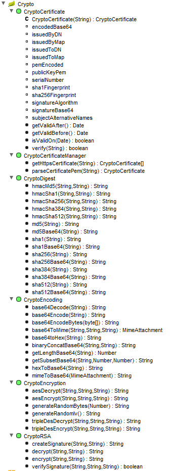

# vRealize Orchestrator Encryption Plugin

## Overview
An inventory-less vRealize Orchestrator (vRO) plugin to provide Encoding, Digest, Cipher, and RSA Encryption.

When an integration or automation project with vRO needed some encryption, developers typically used either CryptoJS or JSEncrypt on top of the Rhino Javascript runtime of Orchestrator.

This plugin provides similar methods, is compatible with binary data and is exponentially more efficient with CPU time.

## Try it out

Latest stable compiled plugin can be found at [releases](https://github.com/vmware/o11n-plugin-crypto/releases)

Add it to your Orchestrator as any other plugin.

### Prerequisites

* vRealize Orchestrator (vRO) 7.0 or greater

### Build From Source

1. Get access to a /vco-repo from a running vRO VM.  Typical URL is http://*vro.corp.local*:8280/vco-repo.  Note the version of your Orchestrator for use in the build command (Ex: 7.1.0, 7.2.0)
2. mvn clean install -Dvco.version=*7.1.0* -DrepoUrl=http://*vro.corp.local*:8280/vco-repo
3. The compiled plugin will be in the *target* directory

## Documentation

Please see the project [wiki](https://github.com/vmware/o11n-plugin-crypto/wiki) for plugin documentation and usage samples.

## Contributing

See [CONTRIBUTING](CONTRIBUTING.md) for details on submitting changes and the contribution workflow.

## License

vRealize Orchestrator Encryption Plugin is available under the [BSD 2-Clause license](LICENSE).
